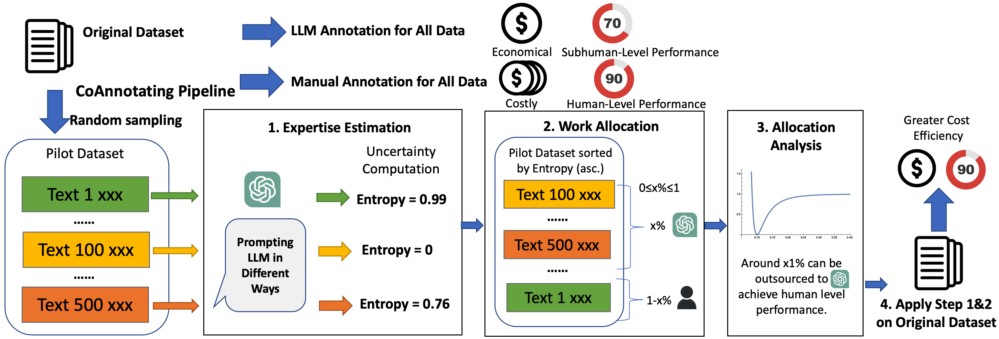

# CoAnnotating: Uncertainty-Guided Work Allocation between Human and Large Language Models for Data Annotation
This repository contains the code implementation for the paper titled "CoAnnotating: Uncertainty-Guided Work Allocation between Human and Large Language Models for Data Annotation"

